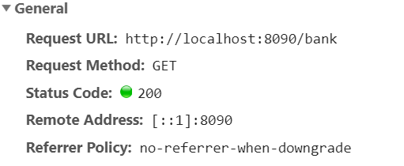
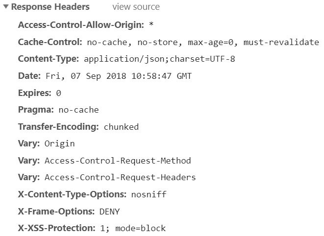
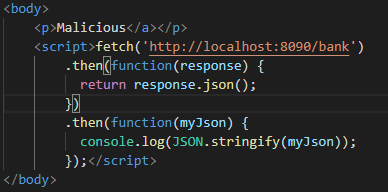
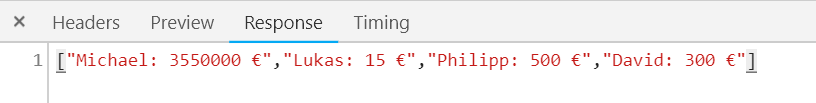
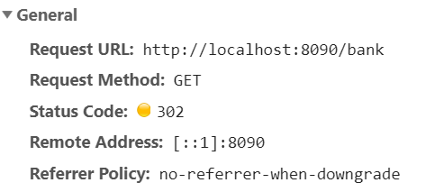
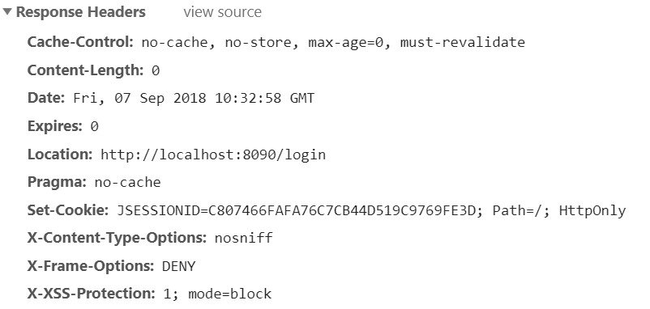
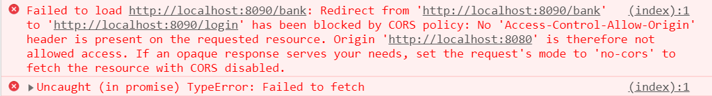

#### Fetching from basic authentification hidden data

### Einstellungen
- @CrossOrigin ist auf meinem BankController enabled.
- Ein Login ist nicht vorhanden.

Bei diesem Versuch habe ich @CrossOrigin mit default Einstellung auf meinen BankController platziert und den Redirect zu __/login__ entfernt. Das Fetchn der Daten hat auf anhieb funktioniert und ich konnte mir in der HTTP Response die Daten als Liste von Strings ansehen. 

### Einstellungen
- @CrossOrigin ist disabled auf dem BankController
- Redirect auf eine /login Page mit Basic Authentification.

Ich habe versucht über ein JavaScript Script die _sensiblen_ Bankdaten aus meiner _API_ unter http://localhost:8090/bank zu bekommen.
Beim fetch werde ich sofort zu __/login__ umgeleitet. In der Console wird mir ein CORS Error ausgeworfen mit den fehlenden Access-Control Headern

### Basic Authentification
Bei zwei offenen Tabs muss ich nur bei einem die Basic Authentification durchführen. Der Browser merkt sich den Login bei dem ersten Tab.

Habe gerade mit der Malicious App einen REST Endpunkt von Innocent aufgerufen und habe die Daten ohne einen Login bekommen.
Vorgehensweise:
    fetch('http://localhost:8080/bank', {
    credentials:'include'
    })
credentials: include war die Zeile die gefehlt hat. Serverseitig habe ich die Credentials schon auf true gesetzt, das hat aber anscheinend nicht gereicht, erst als ich clientseitig es erlaubt habe, hat es funktioniert.
Wenn der User ausgeloggt ist funktioniert es nicht

### 2 Tabs im selben Browser
Funktioniert

### 2 Tabs in verschiedenen Browserfenstern
Funktioniert

### Malicious und Innocent im gleichen Browser
Funktioniert

### Malicious und Innocent in verschiedenen Browserfenstern
Funktioniert

### Login in Chrome und Zugriff von Edge
Funktioniert Nicht

#### 2 Spring Boot Apps auf verschiedene Domains

- Beim Antivirenprogramm den Zugriff auf die Windows host Datei erlauben
- Notepadd++ als Admin starten und Domains eintragen
    - 127.0.0.3 www.example.malicious.com
    - 127.0.0.3 example.malicious.com

    - 127.0.0.2 www.example.innocent.com
    - 127.0.0.2 example.innocent.com
- In Spring Boot application.properties öffnen
    - embedded tomcat addresse und port ändern
        - server.address=127.0.0.2
        - server.port=8090

#### Login/Logout
scheint nicht zu funktionieren mit http basic
